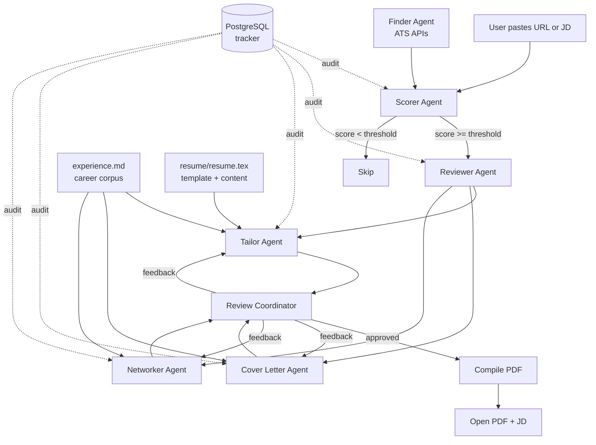

# Shortlist

> AI-powered job search copilot for senior engineers.
> Multi-agent system that scores jobs, tailors resumes, drafts
> cover letters, and generates outreach — grounded in your
> career corpus, not in hallucinations.


## What it does

The senior job search drowns in noise. Most JDs aren't a fit, the relevant
ones still demand resume rework to pass ATS filters, and generic LinkedIn
DMs get ignored. Doing this well across 50+ applications is a part-time
job in itself — and the parts that actually matter (judgement on fit,
narrative framing, choosing what to lead with) get squeezed out by the
parts that don't (formatting, keyword matching, tracking what you sent
where).

Shortlist runs a corpus-grounded multi-agent pipeline over each job:
score across 8 dimensions, detect the right archetype framing
(distributed_systems vs fintech_platform vs ai_ml_engineer, etc.),
review your resume against the JD, then tailor a resume + draft a cover
letter + draft outreach messages — all anchored to bullets you wrote in
your `experience.md` corpus. A human-in-the-loop coordinator lets you
approve or revise each artifact before the PDF compiles.

It's built for senior engineers running their own job search who want
signal-to-noise over volume. If your goal is to apply to 200 places this
quarter, this is the wrong tool. If your goal is to send 20 applications
that each look like the candidate read the JD twice, this is closer.

## Architecture



Design principles:

- **Corpus model prevents fabrication.** Every bullet in the tailored
  resume traces back to either your existing resume or a bullet in
  `experience.md`. Cover letters and DMs reference specific corpus
  bullet IDs you can verify before sending.
- **Archetype-aware framing.** The same JD scored differently for a
  fintech vs distributed-systems vs AI role. The scorer detects the
  archetype; downstream agents apply the right narrative angle.
- **Audit logging on every agent call.** Latency, token usage,
  success/failure, input/output summaries — all in Postgres, queryable
  from the menu.
- **Human-in-the-loop coordinator** for resume / cover / networking
  iteration. Each artifact can be approved, revised with feedback, or
  the whole session aborted.
- **Postgres-backed persistence** so sessions are resumable. If you get
  interrupted mid-tailor, you pick up from the same status next time.

## Quick start

### Prerequisites

- Docker Desktop (for Postgres)
- `uv` (Python package manager): `curl -LsSf https://astral.sh/uv/install.sh | sh`
- An API key for one LLM provider: Anthropic, OpenAI, or Gemini
- `pdflatex` (only needed when you want compiled PDFs — install via
  MacTeX on macOS or `texlive-latex-base` on Debian/Ubuntu)

### Run it

```bash
git clone https://github.com/tusharjayanti/shortlist.git
cd shortlist
./shortlist
```

First run will prompt you to set up:

- `config.yaml` — your candidate profile (copy from `config.example.yaml`)
- `experience.md` — your career corpus (copy from `experience.example.md`)
- `resume/resume.tex` — your LaTeX resume
- `.env` — your LLM provider API key

Once those are in place, `./shortlist` boots directly into the menu.

### Fork-and-customize

If you want to tune the prompts to your voice or your domain:

1. Fork the repo.
2. Edit `prompts/*.md` — these are the system prompts used by each
   agent. They take `{placeholder}` fields filled from your config and
   corpus.
3. Run the test suite to make sure your prompt edits still satisfy the
   schema validators: `uv run pytest tests/`.
4. Pull upstream changes safely: agent logic and prompts may move; your
   config, corpus, and resume are gitignored and won't be touched.

## Configuration

The system has three configuration layers, each with a gitignored user
file and a committed example:

| User file | Example | Purpose |
|-----------|---------|---------|
| `config.yaml` | `config.example.yaml` | Profile, archetypes, ATS sources |
| `experience.md` | `experience.example.md` | Career corpus (all your work) |
| `resume/resume.tex` | (none) | Your LaTeX resume |

See [DATA_CONTRACT.md](DATA_CONTRACT.md) for the full split between
user data and system code, and the rules for safely pulling upstream
changes.

### Key config sections

**Candidate profile** — your name, location, target roles, salary range,
technical strengths. Plus a list of archetypes that downstream agents
key off.

**Archetypes** — each archetype defines how to frame your career for a
specific role type. The `fintech_platform` archetype says "lead with
financial systems work, emphasize idempotency and compliance"; the
`distributed_systems` archetype emphasizes scale, latency, and
reliability instead. The scorer detects which archetype fits each JD;
the tailor, cover letter, and networker agents all apply that framing.

**ATS sources** — Greenhouse, Ashby, and Lever org slugs for companies
you want the finder to scan. Use verified working slugs only — finder
fails fast on 404s.

**Company tiers** — tier 1/2/3 companies with score bonuses applied
after LLM scoring. Tier 1 gets `+3`, tier 3 is blacklisted (`-99` so it
always sorts to grade F).

## How it works

### Menu options

**1. Evaluate a specific job (paste URL or JD).** The reactive flow.
Paste a job URL or job description text. The system scrapes (if URL),
scores, reviews against your corpus, runs tailor + cover + networker,
then enters the review coordinator where you approve or revise each
artifact. PDF compiles after all three are approved.

**2. Run finder + score new jobs.** The proactive flow. The finder hits
configured ATS APIs, dedupes against `seen_urls`, filters by location,
and returns new jobs. Each is scored. Above-threshold jobs appear in a
shortlist table. You pick which to process; each pick runs the full
reactive flow.

**3. Resume an in-progress application.** Lists applications in
`scored` or `shortlisted` status. Picks up wherever the pipeline left
off. Useful if you got interrupted mid-session.

**4. View pipeline status.** Funnel report showing how many applications
are in each pipeline stage (discovered → scored → shortlisted →
tailored → applied → interviewing → offer).

**5. View audit log for an application.** Lists every LLM call made for
a specific application — agent name, action, tokens used, latency,
success/failure. Useful for debugging or analyzing cost.

**6. View grade distribution.** Quick stats: how many A/B/C/D/F grades
you've scored. Useful for tuning your archetype proof points.

**7. View token usage and cost.** Aggregate token spend by agent, with
estimated dollar cost. Useful for budgeting.

## The corpus model

Most resume tools fall into one of two traps:

- **Static template + LLM rewrite:** the LLM has nothing to pull from
  when the JD demands content the resume doesn't cover. So it invents.
- **LLM generates from scratch:** every bullet is freshly generated,
  which means none can be traced back to your actual work.
  Hallucinations everywhere.

Shortlist takes a third path. You write `experience.md` once — a
comprehensive record of every project, every metric, every piece of
work. Far richer than any resume. The tailor agent reads both this
corpus AND your `resume.tex`, then composes a tailored resume that
combines:

- Existing resume bullets (kept as-is or reworded for keyword fit)
- Additional bullets pulled from the corpus (when the JD calls for
  content the resume lacks)

Every bullet in the output traces to either the corpus or the resume.
Cover letters and networking messages reference specific bullet IDs
from the corpus, which you can verify before sending.

## Tech stack

- **Python 3.12** with `uv` for package management
- **Anthropic Claude** (default) — also supports OpenAI and Gemini via
  swappable provider
- **PostgreSQL 16** in Docker for state persistence
- **Pydantic 2** for typed schemas across all agent boundaries
- **Rich** for terminal rendering
- **pdflatex** for PDF compilation
- **pytest** for the test suite

## Cost

Approximate per-application cost on Anthropic Claude Sonnet 4:

| Stage | Tokens | Cost |
|-------|--------|------|
| Score | ~2k in / ~500 out | ~$0.013 |
| Review | ~5k in / ~1k out | ~$0.030 |
| Tailor | ~10k in / ~3k out | ~$0.075 |
| Cover letter | ~6k in / ~800 out | ~$0.030 |
| Networking | ~6k in / ~600 out | ~$0.027 |
| **Total per job** | | **~$0.18** |

Discovery (proactive scan with N jobs) costs N × $0.013 just to score.
Plan accordingly. The system has below-threshold short-circuits to
avoid spending on weak matches.

## Limitations

- **No DiscoveryAgent yet.** Only ATS-API companies (Greenhouse, Ashby,
  Lever). Companies on Workday, Workable, or custom pages need reactive
  mode (paste URL).
- **No interview prep agent yet.** Story bank, round plans, and STAR
  matching are planned for v1.1.
- **No automated apply.** The system stops at "open the JD URL" for the
  user to apply manually. This is deliberate — auto-apply violates most
  ATS terms of service and produces lower signal applications.
- **Single-user only.** No multi-tenancy, no auth. Designed for personal
  use.

## Roadmap (v1.1)

- DiscoveryAgent for non-ATS companies (web search + Playwright)
- Interview prep agent with round plans and story bank
- Funnel analytics dashboard (HTML or Streamlit)
- Liveness check before scoring (skip stale URLs)

## Contributing

This is primarily a personal project, but I'm happy to review PRs that:

- Add support for new ATS providers
- Improve agent prompts based on real usage
- Add provider implementations (e.g., Bedrock, Azure OpenAI)
- Improve the corpus parser

Bug reports and feature requests welcome via GitHub Issues.

## License

MIT. See [LICENSE](LICENSE).

## Acknowledgments

[Career-Ops](https://github.com/santifer/career-ops) by santifer
shipped earlier this year with a similar premise. After it
launched I paused my own work to study what it did well — the
archetype framing concept and the audit-friendly pipeline
design both influenced how Shortlist is structured.

Shortlist takes a different architectural direction: typed
Python with Pydantic schemas across all agent boundaries,
PostgreSQL persistence with audit logging, separation of career
corpus from resume template, and a human-in-the-loop coordinator
for iterative artifact review. It targets senior IC engineers
running their own job search who want production-quality
engineering tooling.
