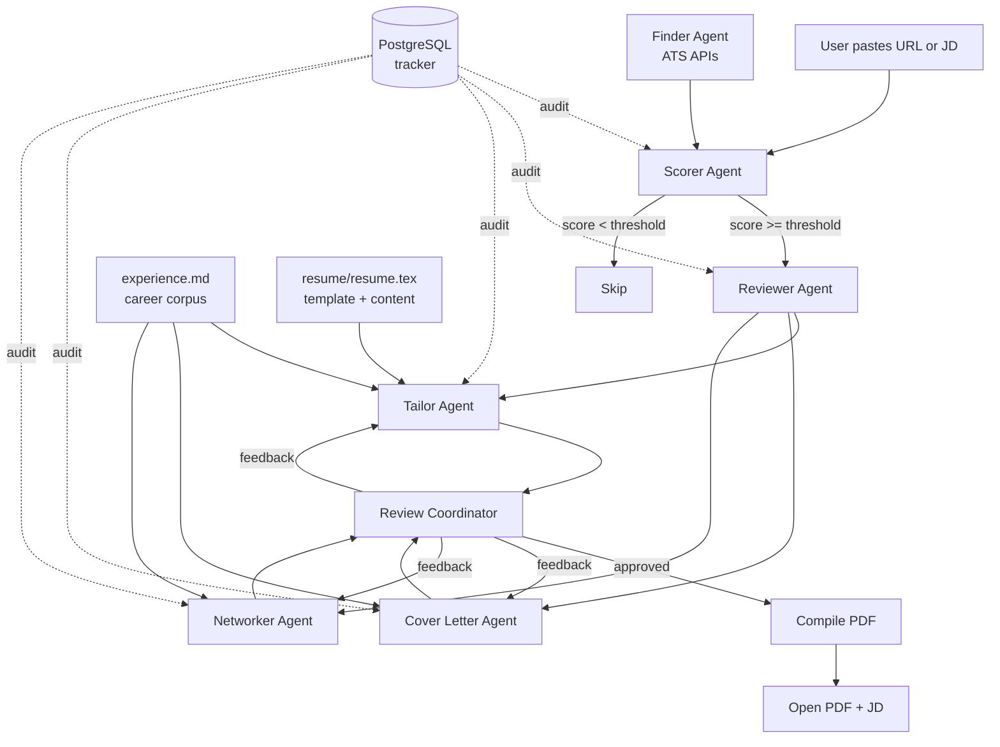

# Shortlist

> AI-powered job search copilot. Multi-agent system that
> scores jobs, tailors resumes, drafts cover letters, and
> generates outreach grounded in your career corpus, not
> in hallucinations.


## What it does

Job searching at any level wastes most of the candidate's
time on triage and tailoring rather than actually engaging
with opportunities worth pursuing. Generic resumes get
filtered out by ATS systems. Cover letters that don't speak
to the specific role get ignored. Time spent applying to
poor-fit roles is time not spent on roles where you'd
actually thrive.

Shortlist is a multi-agent system that handles the parts of
job searching that shouldn't take your time. Six AI agents
work together to score each role against your background
across 8 dimensions, identify gaps between the JD and your
resume, tailor your CV with archetype-aware framing, draft
a role-specific cover letter, and generate outreach for
LinkedIn and email. Every artifact is grounded in a career
corpus you write once and the system selects proof points from
your real work, never invents them. State persists in
PostgreSQL with audit logs on every LLM call, so you can
resume interrupted sessions and review the reasoning behind
any output.

It's built for anyone running their own job search who wants
real engineering rigor in the loop, typed schemas,
persistent state, audit trails on every LLM call, and
outputs grounded in your actual work. Engineers, designers,
product managers, marketers, finance professionals,
researchers, anyone whose work has accumulated meaningful
proof points worth surfacing for the right opportunities.
Comfortable with a terminal and willing to spend an hour
writing your career corpus? You're the audience.

## Architecture



Design principles:

- **Corpus model prevents fabrication.** Every bullet in the tailored
  resume traces back to either your existing resume or a bullet in
  `experience.md`. Cover letters and DMs reference specific corpus
  bullet IDs you can verify before sending.
- **Archetype-aware framing.** The same JD scored differently for a
  fintech vs distributed-systems vs AI role. The scorer detects the
  archetype; downstream agents apply the right narrative angle.
- **Audit logging on every agent call.** Latency, token usage,
  success/failure, input/output summaries — all in Postgres, queryable
  from the menu.
- **Human-in-the-loop coordinator** for resume / cover / networking
  iteration. Each artifact can be approved, revised with feedback, or
  the whole session aborted.
- **Postgres-backed persistence** so sessions are resumable. If you get
  interrupted mid-tailor, you pick up from the same status next time.

## Quick start

### Prerequisites

- Docker Desktop (for Postgres)
- `uv` (Python package manager): `curl -LsSf https://astral.sh/uv/install.sh | sh`
- An API key for one LLM provider: Anthropic, OpenAI, or Gemini
- `pdflatex` (only needed when you want compiled PDFs — install via
  MacTeX on macOS or `texlive-latex-base` on Debian/Ubuntu)

### Run it

```bash
git clone https://github.com/tusharjayanti/shortlist.git
cd shortlist
./shortlist
```

First run will prompt you to set up:

- `config.yaml` — your candidate profile (copy from `config.example.yaml`)
- `experience.md` — your career corpus (copy from `experience.example.md`)
- `resume/resume.tex` — your LaTeX resume
- `.env` — your LLM provider API key

Once those are in place, `./shortlist` boots directly into the menu.

### Fork-and-customize

If you want to tune the prompts to your voice or your domain:

1. Fork the repo.
2. Edit `prompts/*.md` — these are the system prompts used by each
   agent. They take `{placeholder}` fields filled from your config and
   corpus.
3. Run the test suite to make sure your prompt edits still satisfy the
   schema validators: `uv run pytest tests/`.
4. Pull upstream changes safely: agent logic and prompts may move; your
   config, corpus, and resume are gitignored and won't be touched.

## Configuring Shortlist

Three files contain everything personal to your search. Each
deserves real attention on first setup — the quality of the
output depends almost entirely on the quality of these inputs.
See [DATA_CONTRACT.md](DATA_CONTRACT.md) for the full split
between user data and system code.

### `config.yaml` — your candidate profile

This file tells the system who you are and what you're
looking for. The example file (`config.example.yaml`) is
fully commented — open it alongside this guide.

**Candidate section.** Your name, location, years of
experience, target role types, salary expectations, and a
free-text description of your career direction. The
`target_role_description` field is used in agent prompts to
frame how the system thinks about you (e.g.,
`"senior software engineering with backend and AI focus"`
vs `"product management with B2B SaaS focus"`).

**Archetypes.** This is the most important section to get
right. An archetype defines how to position yourself for a
specific category of role. You typically need 4-6 archetypes
covering the kinds of roles you'd apply to.

Each archetype has three fields:

- `lead_with` — the opening framing for resumes and cover
  letters when this archetype is detected
- `proof_points` — the categories of work that should surface
  prominently
- `keywords` — terms commonly seen in JDs that match this
  archetype

Example for a backend engineer:

```yaml
archetypes:
  fintech_platform:
    lead_with: "high-throughput financial systems experience"
    proof_points:
      - idempotent transaction processing
      - PCI compliance and audit trails
      - high-availability payment workflows
    keywords:
      - payments
      - fintech
      - PCI
      - idempotent
      - transaction

  distributed_systems:
    lead_with: "distributed systems at scale"
    proof_points:
      - event-driven architectures
      - low-latency service design
      - production reliability engineering
    keywords:
      - distributed
      - scale
      - latency
      - throughput
      - reliability
```

The scorer agent reads JDs and detects which archetype fits
best. Downstream agents (tailor, cover letter, networker)
all use that archetype's framing. The same JD can produce
very different outputs depending on archetype detection —
which is exactly the point.

When writing your archetypes, ask: "What kind of role am I
applying for, and what would a great candidate for that role
emphasize that's different from a great candidate for a
related role?" That difference is your archetype.

**Companies and tiers.** Organize companies into tiers based
on your preference:

- Tier 1: dream companies (small score bonus applied)
- Tier 2: strong fits (no bonus)
- Tier 3: blacklist (excluded from finder results)

The finder uses the configured ATS slugs (Greenhouse, Ashby,
Lever) to discover new jobs. Add slugs for any companies
you actively want the finder to scan. The example file lists
verified working slugs you can start with.

**Scoring thresholds.** `min_score_to_surface` controls
which jobs make it past the scorer into the rest of the
pipeline. Default is 7 (out of 13). Lower it if you want to
see more borderline matches; raise it if you only want to
spend tokens on strong fits.

**LLM provider.** Set `llm.provider` to `anthropic`,
`openai`, or `gemini`. The matching API key in `.env` will
be used.

### `experience.md` — your career corpus

This file is the single most important input to the system.
Every bullet in your tailored resume, every proof point in
your cover letters, every concrete reference in your outreach
messages must trace back to a paragraph here. If something
isn't in `experience.md`, the system can't claim it.

This is far richer than your resume. Your resume might have
4 bullets per role; `experience.md` should have 6-10
paragraphs per role, each describing one project, problem,
or responsibility in 2-5 sentences.

**Format.** Light Markdown structure:

```markdown
# Your Name — Experience Corpus

## Company Name (Job Title)
**Dates:** Start - End
**Tech stack:** Comma-separated list of tools, languages, frameworks

### Short title for the project or work
A paragraph describing what you did, the problem you were
solving, the scale, the technologies, the outcome. Include
real numbers wherever possible — they make the difference
between "improved performance" and "reduced p99 latency from
4.2s to 1s under 10k+ TPS load."

### Another short title
Another paragraph describing different work at the same
company. Each ### heading creates a separate selectable
bullet that the tailor agent can include or skip per JD.
```

**What to include per role:**

- Major projects you owned, with metrics where they exist
- Architectural decisions you made or influenced
- Performance work, optimization, scale milestones
- Cross-functional collaboration that mattered
- Mentorship, hiring, or team-building you contributed to
- On-call work, incident response, runbooks written
- Open source contributions, talks, internal documentation
- Anything you'd be comfortable being asked about in an
  interview

**What's worth its own bullet:**

A bullet should describe one cohesive piece of work. "I built
the X feature" is one bullet. "I built the X feature and
also led the Y migration and also wrote the Z documentation"
is three bullets, even if all three happened in the same
quarter. Granularity matters because the tailor selects per
JD — three smaller bullets give the system more options than
one composite bullet.

**Personal projects section.** Use this for side projects,
open source contributions, or anything outside salaried
work. Same format as roles but typically lighter.

**Education section.** Standard — degree, institution, year,
relevant coursework if early-career. The system surfaces
education in tailored resumes but doesn't usually rewrite it.

Plan to spend 60-90 minutes on first draft. The act of
writing this is genuinely useful regardless of the system —
forces you to articulate what you've actually done with full
detail rather than the compressed resume version.

You can always come back and add more. The richer it gets
over time, the better the system performs.

### `resume/resume.tex` — your existing LaTeX resume

The tailor agent uses this for two things:
1. The LaTeX template (document class, packages, formatting)
2. Existing bullet content that may be kept, reworded, or
   replaced with corpus material per JD

If you don't have a LaTeX resume yet, you can:
- Generate one from your existing PDF using Overleaf
- Pick from the wide range of LaTeX resume templates on
  Overleaf or GitHub and adapt one to your profession
- Convert your existing Word or Google Docs resume manually

The system doesn't require any specific LaTeX template — it
adapts to whatever structure you provide. Headers, sections,
bullet styles — all preserved.

## Customizing the prompts

The system prompts that drive each agent live in `prompts/`
as plain Markdown files — `scorer.md`, `reviewer.md`,
`tailor.md`, `cover.md`, `networker.md`. They're the most
direct way to adapt Shortlist to your specific context.

### Why prompts are externalized

Prompts encode a lot of opinions about what makes a good
resume bullet, what makes a strong cover letter, how to
score a JD. The defaults are calibrated for senior software
engineering roles because that's what the system was built
for first. They work reasonably well across other
professions, but they won't be optimal until adjusted for
your context.

Examples of when you'd want to edit prompts:

- **Different profession.** A product manager applying for
  PM roles should adjust `scorer.md` so the 8 dimensions
  weigh things like product instinct, stakeholder management,
  and roadmap thinking instead of system design depth and
  on-call experience. Same idea for designers, marketers,
  finance — each profession has its own evaluation rubric.

- **Different seniority level.** Early-career candidates need
  the reviewer agent to surface different gaps than
  senior-level ones. A junior engineer probably shouldn't be
  expected to demonstrate "led a team-wide migration" — but
  the default prompts implicitly assume that experience.

- **Different industry framing.** A backend engineer
  applying to defense contractors needs different language
  than one applying to consumer fintech. Tone, emphasis on
  compliance, what counts as relevant experience — all worth
  adjusting.

- **Different language or region.** Cover letter conventions
  vary by country. American resumes lead with achievements;
  German resumes are more chronological. Adjust the cover
  letter prompt to match the convention of where you're
  applying.

### How to edit prompts

Each prompt is a regular Markdown file with `{placeholder}`
tokens that get filled in at runtime with values from your
config. Keep the placeholders intact when editing — they're
how your candidate profile flows into the prompt.

For example, `prompts/scorer.md` contains lines like:

```
Candidate profile:
- Name: {name}
- {experience_years} years of {target_role_description}
- Stack: {backend}, {databases}, {cloud_devops}
```

The `{name}` token is replaced with `config.candidate.name`
when the agent runs. Don't remove or rename these tokens —
the agent's `_build_system_prompt` method expects them.

Beyond the placeholders, everything else is plain English
instructions to the LLM. Edit freely. Add sections, remove
sections, rewrite the evaluation rubric. Whatever prompt you
end up with becomes the prompt for every run.

### Suggested editing workflow

1. Run the system once with default prompts to get a baseline.
2. Identify what's off. Did the scorer rate a good role too
   low? Did the tailor over-rotate to keywords that aren't
   really your strength?
3. Edit the relevant prompt. Save.
4. Re-run on the same JD. Compare outputs.
5. Iterate until the system reflects your judgment.

The audit logs in PostgreSQL preserve every LLM call with
its inputs and outputs, so you can compare runs across
prompt edits.

### Sharing prompt sets

If you adapt prompts for a specific profession or context
and they work well, consider opening a PR to add them as a
preset. The repo currently ships software-engineering
defaults, but a PM preset, a designer preset, or a finance
preset would be genuinely useful contributions. See
[CONTRIBUTING.md](CONTRIBUTING.md) for the workflow.

## How it works

### Menu options

**1. Evaluate a specific job (paste URL or JD).** The reactive flow.
Paste a job URL or job description text. The system scrapes (if URL),
scores, reviews against your corpus, runs tailor + cover + networker,
then enters the review coordinator where you approve or revise each
artifact. PDF compiles after all three are approved.

**2. Run finder + score new jobs.** The proactive flow. The finder hits
configured ATS APIs, dedupes against `seen_urls`, filters by location,
and returns new jobs. Each is scored. Above-threshold jobs appear in a
shortlist table. You pick which to process; each pick runs the full
reactive flow.

**3. Resume an in-progress application.** Lists applications in
`scored` or `shortlisted` status. Picks up wherever the pipeline left
off. Useful if you got interrupted mid-session.

**4. View pipeline status.** Funnel report showing how many applications
are in each pipeline stage (discovered → scored → shortlisted →
tailored → applied → interviewing → offer).

**5. View audit log for an application.** Lists every LLM call made for
a specific application — agent name, action, tokens used, latency,
success/failure. Useful for debugging or analyzing cost.

**6. View grade distribution.** Quick stats: how many A/B/C/D/F grades
you've scored. Useful for tuning your archetype proof points.

**7. View token usage and cost.** Aggregate token spend by agent, with
estimated dollar cost. Useful for budgeting.

## The corpus model

Most resume tools fall into one of two traps:

- **Static template + LLM rewrite:** the LLM has nothing to pull from
  when the JD demands content the resume doesn't cover. So it invents.
- **LLM generates from scratch:** every bullet is freshly generated,
  which means none can be traced back to your actual work.
  Hallucinations everywhere.

Shortlist takes a third path. You write `experience.md` once — a
comprehensive record of every project, every metric, every piece of
work. Far richer than any resume. The tailor agent reads both this
corpus AND your `resume.tex`, then composes a tailored resume that
combines:

- Existing resume bullets (kept as-is or reworded for keyword fit)
- Additional bullets pulled from the corpus (when the JD calls for
  content the resume lacks)

Every bullet in the output traces to either the corpus or the resume.
Cover letters and networking messages reference specific bullet IDs
from the corpus, which you can verify before sending.

## Tech stack

- **Python 3.12** with `uv` for package management
- **Anthropic Claude** (default) — also supports OpenAI and Gemini via
  swappable provider
- **PostgreSQL 16** in Docker for state persistence
- **Pydantic 2** for typed schemas across all agent boundaries
- **Rich** for terminal rendering
- **pdflatex** for PDF compilation
- **pytest** for the test suite

## Cost

Approximate per-application cost on Anthropic Claude Sonnet 4:

| Stage | Tokens | Cost |
|-------|--------|------|
| Score | ~2k in / ~500 out | ~$0.013 |
| Review | ~5k in / ~1k out | ~$0.030 |
| Tailor | ~10k in / ~3k out | ~$0.075 |
| Cover letter | ~6k in / ~800 out | ~$0.030 |
| Networking | ~6k in / ~600 out | ~$0.027 |
| **Total per job** | | **~$0.18** |

Discovery (proactive scan with N jobs) costs N × $0.013 just to score.
Plan accordingly. The system has below-threshold short-circuits to
avoid spending on weak matches.

## Limitations

- **No DiscoveryAgent yet.** Only ATS-API companies (Greenhouse, Ashby,
  Lever). Companies on Workday, Workable, or custom pages need reactive
  mode (paste URL).
- **No interview prep agent yet.** Story bank, round plans, and STAR
  matching are planned for v1.1.
- **No automated apply.** The system stops at "open the JD URL" for the
  user to apply manually. This is deliberate — auto-apply violates most
  ATS terms of service and produces lower signal applications.
- **Single-user only.** No multi-tenancy, no auth. Designed for personal
  use.

## Roadmap (v1.1)

- DiscoveryAgent for non-ATS companies (web search + Playwright)
- Interview prep agent with round plans and story bank
- Funnel analytics dashboard (HTML or Streamlit)
- Liveness check before scoring (skip stale URLs)

## Contributing

This is primarily a personal project, but I'm happy to review PRs that:

- Add support for new ATS providers
- Improve agent prompts based on real usage
- Add provider implementations (e.g., Bedrock, Azure OpenAI)
- Improve the corpus parser

Bug reports and feature requests welcome via GitHub Issues.

## License

MIT. See [LICENSE](LICENSE).

## Acknowledgments

[Career-Ops](https://github.com/santifer/career-ops) by santifer
shipped earlier this year with a similar premise. After it
launched I paused my own work to study what it did well — the
archetype framing concept and the audit-friendly pipeline
design both influenced how Shortlist is structured.

Shortlist takes a different architectural direction: typed
Python with Pydantic schemas across all agent boundaries,
PostgreSQL persistence with audit logging, separation of career
corpus from resume template, and a human-in-the-loop coordinator
for iterative artifact review. It's built for self-directed
candidates who want real engineering rigor in their job search
tooling typed schemas, persistent state, audit trails, and
outputs grounded in their actual work.
